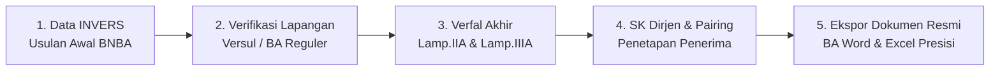

# BUKU PANDUAN PENGGUNA (USER HANDBOOK)
# APLIKASI BEDAH RUMAH (SIVERI BSPS)
### Kementerian Perumahan dan Kawasan Permukiman (PKP)
**Versi Sistem: 1.1.0 (Tahun Anggaran 2026)**

---

## DAFTAR ISI
1. [BAB 1: Pengenalan & Arsitektur Sistem](#bab-1-pengenalan--arsitektur-sistem)
2. [BAB 2: Manajemen Akun & Hak Akses Pengguna](#bab-2-manajemen-akun--hak-akses-pengguna)
3. [BAB 3: Manajemen Wilayah Provinsi & Tahap Kegiatan](#bab-3-manajemen-wilayah-provinsi--tahap-kegiatan)
4. [BAB 4: Modul 1 - Data Usulan Awal (INVERS)](#bab-4-modul-1---data-usulan-awal-invers)
5. [BAB 5: Modul 2 - Verifikasi Lapangan (Versul & BA Reguler)](#bab-5-modul-2---verifikasi-lapangan-versul--ba-reguler)
6. [BAB 6: Modul 3 - Verfal (Verifikasi & Validasi Akhir)](#bab-6-modul-3---verfal-verifikasi--validasi-akhir)
7. [BAB 7: Modul 4 - SK Dirjen & Pairing Data](#bab-7-modul-4---sk-dirjen--pairing-data)
8. [BAB 8: Modul 5 - Pencarian Global & Rekapitulasi Data](#bab-8-modul-5---pencarian-global--rekapitulasi-data)
9. [BAB 9: Modul 6 - Log Aktifitas User (Audit Trail)](#bab-9-modul-6---log-aktifitas-user-audit-trail)
10. [BAB 10: Format Template Excel & Panduan Troubleshooting](#bab-10-format-template-excel--panduan-troubleshooting)

---

## BAB 1: Pengenalan & Arsitektur Sistem

### 1.1 Latar Belakang
Aplikasi **Bedah Rumah (SIVERI BSPS)** adalah sistem informasi berbasis web yang dirancang khusus untuk mengelola, memverifikasi, memvalidasi, serta menyusun dokumen pelaporan resmi kegiatan **Bantuan Stimulan Perumahan Swadaya (BSPS)** di lingkungan Kementerian Perumahan dan Kawasan Permukiman (PKP).

Sistem ini memastikan keakuratan data Calon Penerima Bantuan (CPB), mencegah terjadinya duplikasi bantuan antar-wilayah atau antar-tahap, memfasilitasi rekonsiliasi data pengganti secara transparan, serta menghasilkan Berita Acara (BA) dan Lampiran Laporan Resmi dalam format Microsoft Word (`.docx`) dan Microsoft Excel (`.xlsx`) yang presisi 1:1 sesuai standar kementerian.

### 1.2 Alur Besar Pengolahan Data (End-to-End Workflow)



1. **INVERS (Informasi Verifikasi Swadaya)**: Mengunggah database usulan awal (BNBA) lengkap dengan identitas kependudukan (NIK 16-digit, No.KK, Alamat, Kode Wilayah).
2. **Verifikasi Lapangan (Versul)**: Mengunggah hasil pengecekan fisik di lapangan, mendeteksi status Lolos/Tidak Lolos/Pengganti, dan mengidentifikasi duplikasi usulan.
3. **Verfal (Verifikasi & Validasi)**: Mengolah data validasi final (Lampiran IIA dan Lampiran IIIA dengan 22 kolom), mencocokkan data Tidak Lolos dan data Pengganti secara otomatis ke database induk.
4. **SK Dirjen**: Menghubungkan data penerima bantuan dengan Surat Keputusan (SK) Direktur Jenderal melalui mekanisme pencocokan (*pairing*) otomatis maupun manual.
5. **Pelaporan Resmi**: Mencetak Berita Acara Word lengkap dengan kop gambar kementerian, tanda tangan pejabat, dan matriks rekapitulasi Excel.

---

## BAB 2: Manajemen Akun & Hak Akses Pengguna

### 2.1 Hak Akses (Role Permission)
Aplikasi membagi hak akses ke dalam 2 tingkat wewenang:
- **Administrator (`admin`)**: Memiliki akses penuh untuk membuat/mengedit/menghapus tahap, mengunggah data (Invers, Versul, Verfal, SK Dirjen), melakukan rekonsiliasi data, mencetak Berita Acara, serta mengakses modul *Log Aktifitas User*.
- **Viewer (`viewer`)**: Memiliki akses hanya-baca (*read-only*) untuk melihat dasbor, memantau metrik data, serta melakukan pencarian data global tanpa dapat mengubah atau menghapus basis data.

### 2.2 Prosedur Masuk (Login)
1. Buka aplikasi pada peramban web (Google Chrome / Microsoft Edge disarankan).
2. Jika belum login, sistem akan menampilkan jendela **Masuk ke Bedah Rumah**.
3. Masukkan **Username** dan **Password**.
4. Klik tombol **Masuk Aplikasi**.
5. Setelah berhasil, nama lengkap dan role pengguna akan tampil pada kartu profil di bagian bawah bilah menu (*sidebar*).

### 2.3 Prosedur Mengubah Password Akun
Setiap pengguna dapat memperbarui kata sandi akun secara mandiri:
1. Perhatikan kartu akun pengguna di sudut kiri bawah bilah navigasi.
2. Klik tombol bertanda kunci **`🔑 Ubah Password`**.
3. Pada jendela dialog:
   - Masukkan **Password Baru** (minimal 6 karakter). Anda dapat mengklik ikon mata untuk melihat karakter kata sandi.
   - Masukkan kembali pada **Konfirmasi Password Baru**.
4. Klik tombol **Simpan Password Baru**.
5. Sistem akan menampilkan notifikasi konfirmasi dan mencatat perubahan tersebut ke dalam log audit.

---

## BAB 3: Manajemen Wilayah Provinsi & Tahap Kegiatan

### 3.1 Isolasi Data Multi-Wilayah (Scope Isolation)
Aplikasi mendukung multi-provinsi dengan isolasi data independen. Setiap data usulan, verifikasi, dan SK terikat pada provinsi yang sedang aktif di bilah navigasi.

### 3.2 Menambahkan Wilayah Provinsi Kustom
Jika Anda ingin membedakan cakupan wilayah tertentu (misalnya membedakan wilayah perkotaan dan perdesaan):
1. Pada bagian atas bilah navigasi kiri, klik dropdown **Provinsi**.
2. Klik tombol **`+ Tambah Provinsi Baru`**.
3. Masukkan nama wilayah. Anda dapat menggunakan format tag angle bracket, contoh:
   ```text
   SULAWESI SELATAN <perkotaan/perdesaan>
   ```
   atau
   ```text
   SULAWESI SELATAN (Wilayah Kawasan Permukiman)
   ```
4. Klik **Simpan Provinsi**.
5. Sistem akan menyimpan nama wilayah tersebut secara rapi pada antarmuka, sekaligus menyediakan ruang kerja baru yang bersih (*clean database scope*).

> [!IMPORTANT]
> **Normalisasi Otomatis Kop Laporan**:
> Meskipun Anda menambahkan pembeda wilayah seperti `(Perkotaan/Perdesaan)`, sistem secara otomatis menormalisasi nama provinsi pada seluruh hasil ekspor dokumen resmi (**BA Word** dan **Excel Lamp.IA, IIA, IIIA**) sehingga hanya tercantum judul resmi: **`PROVINSI SULAWESI SELATAN`**.

### 3.3 Manajemen Tahap Kegiatan (Invers Stages)
Setiap kegiatan BSPS dikelompokkan ke dalam **Tahap Kegiatan** (misalnya: *Tahap 1*, *Tahap 2*, *Reguler 2026*):
- **Menambah Tahap Baru**: Klik tombol **`+ Tambah Tahap`** pada menu Tahap di sidebar.
- **Berpindah Tahap**: Klik salah satu tombol tahap pada bilah navigasi. Seluruh metrik, daftar batch, dan tabel data akan beralih secara instan.
- **Mengedit/Menghapus Tahap**: Administrator dapat mengklik ikon pengaturan pada header tahap untuk mengubah nama atau menghapus tahap beserta datanya.

---

## BAB 4: Modul 1 - Data Usulan Awal (INVERS)

### 4.1 Deskripsi & Fungsi
Data INVERS merupakan basis data induk usulan awal sebelum verifikasi lapangan dilakukan. Data ini memuat nama calon penerima, nomor identitas kependudukan, alamat lengkap, dan delineasi wilayah.

### 4.2 Prosedur Unggah Data Invers
1. Pilih Provinsi dan Tahap Kegiatan yang dituju.
2. Pada bilah navigasi kiri, klik tab **`Data Invers`** atau buka menu **`Unggah Data`**.
3. Pilih opsi **Unggah Usulan Invers Baru**.
4. Masukkan **Nama Revisi** (contoh: *Invers Awal 2026* atau *Revisi Usulan 2*).
5. Klik area upload untuk memilih file Excel (`.xlsx` / `.xls`).
6. Klik **Mulai Proses Unggah**.
7. Sistem akan memvalidasi struktur data dan menyimpan seluruh baris ke dalam database.

### 4.3 Spesifikasi Kolom Data Invers
| No | Nama Kolom Excel | Format / Keterangan | Wajib? |
|:---:|:---|:---|:---:|
| 1 | `NO` | Nomor urut data (Angka) | Ya |
| 2 | `KODE DESA` | 10 digit kode wilayah Kemendagri | Opsional |
| 3 | `PROVINSI` | Nama Provinsi | Ya |
| 4 | `KAB./KOTA` | Nama Kabupaten / Kota | Ya |
| 5 | `KECAMATAN/DISTRIK` | Nama Kecamatan | Ya |
| 6 | `DESA/KELURAHAN` | Nama Desa atau Kelurahan | Ya |
| 7 | `DELINEASI` | Perkotaan / Perdesaan / Kumuh | Opsional |
| 8 | `NAMA LENGKAP` | Nama lengkap calon penerima sesuai KTP | Ya |
| 9 | `NO. KTP` / `NIK` | 16 digit Nomor Induk Kependudukan | Ya |
| 10 | `NO. KK` | 16 digit Nomor Kartu Keluarga | Opsional |
| 11 | `ALAMAT` | Alamat tempat tinggal / nama dusun | Ya |
| 12 | `JENIS KELAMIN` | L atau P | Ya |

### 4.4 Sistem Multi-Revisi Invers (Revision Tracking)
Jika terdapat perbaikan data usulan dari instansi pengusul:
- Administrator dapat mengunggah file revisi baru tanpa menghapus data revisi lama.
- Sistem akan otomatis menetapkan revisi terbaru sebagai **Revisi Aktif**.
- Pengguna dapat beralih melihat riwayat revisi sebelumnya melalui dropdown revisi.

---

## BAB 5: Modul 2 - Verifikasi Lapangan (Versul & BA Reguler)

### 5.1 Deskripsi Modul
Modul Verifikasi Lapangan digunakan untuk mengunggah hasil survei faktual di lapangan. Sistem secara cerdas mendeteksi calon penerima yang dinyatakan **LOLOS**, **TIDAK LOLOS**, maupun calon penerima **PENGGANTI**.

### 5.2 Deteksi Duplikasi Otomatis & Rekonsiliasi
Saat file verifikasi diunggah, sistem secara otomatis:
1. Memeriksa apakah NIK CPB sudah pernah lolos verifikasi pada batch lain atau tahap sebelumnya.
2. Jika terdeteksi ganda, sistem menandai record sebagai `Duplikat` untuk mencegah penerima bantuan ganda.
3. Administrator dapat membuka jendela **Rekonsiliasi & Override** untuk memeriksa dan memberikan izin khusus jika data duplikat tersebut sah secara administratif.

### 5.3 Ekspor Berita Acara Reguler & Laporan Excel
1. Klik batch verifikasi yang ingin dicetak laporannya.
2. Klik tombol **`Ekspor Berita Acara`**:
   - **Format Word (`.docx`)**: Mengisi nomor BA, tanggal terbit, perihal, dan rincian alokasi secara otomatis ke template resmi.
   - **Format Excel Rekapitulasi**: Menghasilkan file Excel berisi 3 lembar kerja (*Lampiran IA* Ringkasan Kabupaten, *Lampiran IIA* Daftar Lolos, *Lampiran IIIA* Daftar Tidak Lolos & Pengganti).

---

## BAB 6: Modul 3 - Verfal (Verifikasi & Validasi Akhir)

### 6.1 Struktur Standar Template Verfal Excel
File Excel Verfal terdiri dari 2 lembar kerja utama:
- **`Lamp.IIA` (Daftar Lolos)**: Memuat 16 kolom data CPB yang dinyatakan memenuhi syarat.
- **`Lamp.IIIA` (Daftar Tidak Lolos & Pengganti)**: Memuat **22 kolom** data berpasangan (Sisi Kiri: CPB Tidak Lolos; Sisi Kanan: CPB Pengganti).

```text
Struktur Kolom Lamp.IIIA (22 Kolom):
[TIDAK LOLOS]                                         [PENGGANTI]
Col 1: NO.                                            Col 11: BNBA (NO. URUT)
Col 2: NAMA                                           Col 12: NAMA (PENGGANTI)
Col 3: JENIS KELAMIN (L/P)                           Col 13: JENIS KELAMIN (L/P)
Col 4: NO.KTP                                         Col 14: NO.KTP (PENGGANTI)
Col 5: NO.KK                                          Col 15: NO.KK (PENGGANTI)
Col 6: ALAMAT TEMPAT TINGGAL                          Col 16: ALAMAT TEMPAT TINGGAL
Col 7: DESA / KELURAHAN                               Col 17: DESA / KELURAHAN
Col 8: KECAMATAN                                      Col 18: KECAMATAN
Col 9: KABUPATEN                                      Col 19: KABUPATEN
Col 10: ALASAN TIDAK LOLOS *)                         Col 20: TAHAP
                                                      Col 21: TANGGAL
                                                      Col 22: KETERANGAN
```

### 6.2 Dasbor Metrik Kabupaten (Metric Grid)
Pada halaman Verfal, setiap kabupaten disajikan dalam bentuk kartu ringkasan interaktif:
- **CPB Lolos**: Jumlah penerima yang memenuhi syarat (badge hijau).
- **CPB Tidak Lolos**: Jumlah penerima yang didiskualifikasi (badge merah).
- **CPB Pengganti**: Jumlah penerima pengganti yang diusulkan (badge amber).
- **Sisa Alokasi**: Selisih usulan yang belum terisi (badge abu-abu).

### 6.3 Prosedur Ekspor Berita Acara Verfal (.docx)
1. Pada panel Verfal, klik tombol **`📄 Ekspor BA Verfal`**.
2. Jendela formulir parameter Berita Acara akan terbuka:
   - **Nomor BA Verfal & Nomor BA Versul**: Masukkan nomor surat dinas.
   - **Alasan Tidak Lolos Terbanyak**: Sistem secara cerdas menghitung dan mengisi alasan terbanyak secara otomatis dari kolom data (tetap dapat disunting manual).
   - **Pejabat Penandatangan**: Masukkan Nama Pejabat Kepala Balai dan Nama Ketua Tim.
   - **Tanggal Dokumen**: Pilih tanggal penerbitan.
3. Klik tombol **Cetak Berita Acara**.
4. Sistem mengunduh file `.docx` siap cetak lengkap dengan Kop Surat Bergambar Kementerian PKP dan tabel rekapitulasi presisi.

### 6.4 Prosedur Ekspor Excel Verfal Presisi 1:1
1. Klik tombol **`📊 Ekspor Excel Verfal`**.
2. Sistem akan menghasilkan file Excel dengan format cell, warna header, lebar kolom, dan **blok tanda tangan pejabat di bawah tabel (Lamp.IIA dan Lamp.IIIA)** yang presisi sesuai standar pelaporan kementerian.

---

## BAB 7: Modul 4 - SK Dirjen & Pairing Data

### 7.1 Deskripsi Modul
Modul SK Dirjen digunakan untuk mengintegrasikan Surat Keputusan Penetapan Calon Penerima Bantuan yang diterbitkan oleh Direktorat Jenderal Perumahan/PKP dengan data riil di lapangan.

### 7.2 Alur Unggah & Pencocokan Data (Pairing)
1. Unggah file Excel SK Dirjen (memuat Nomor SK, Tanggal SK, NIK, Nama, dan Alokasi).
2. Sistem secara otomatis melakukan **Auto-Pairing**:
   - Mencocokkan NIK penerima di SK dengan NIK pada data Verfal / Invers.
   - Memberikan status kecocokan (*Matched* / *Unmatched*).
3. Untuk data yang belum cocok otomatis (misal terjadi perbedaan pengetikan nama atau NIK), gunakan fitur **Manual Pairing**:
   - Klik tombol **`Pairing Manual`** pada baris data.
   - Cari data CPB berdasarkan nama atau nomor KTP.
   - Pilih dan tautkan data.

---

## BAB 8: Modul 5 - Pencarian Global & Rekapitulasi Data

### 8.1 Fitur Pencarian Cepat
Menu **Pencarian Global** memungkinkan pengguna menelusuri riwayat penerima bantuan di seluruh database:
- **Pencarian Kata Kunci**: Cari berdasarkan NIK (16 digit), No.KK, Nama Penerima, atau Alamat.
- **Filter Wilayah**: Batasi pencarian berdasarkan Kabupaten, Kecamatan, atau Desa tertentu.
- **Filter Status**: Saring berdasarkan status Lolos, Tidak Lolos, Pengganti, atau Terkait SK Dirjen.

### 8.2 Ekspor Hasil Pencarian
Hasil pencarian dapat diunduh ke dalam format Microsoft Excel dengan mengklik tombol **`Ekspor Hasil Pencarian`** untuk keperluan audit, verifikasi silang, atau laporan insidental.

---

## BAB 9: Modul 6 - Log Aktifitas User (Audit Trail)

### 9.1 Deskripsi Fitur
Modul **Log Aktifitas** terletak di bilah navigasi kiri (tepat di bawah menu *Unggah Data*) dan hanya dapat diakses oleh akun Administrator. Fitur ini mencatat seluruh jejak audit aktivitas secara waktu nyata (*real-time*).

### 9.2 Data yang Dicatat dalam Log
- **Aktivitas Autentikasi**: Login Berhasil, Login Gagal, Perubahan Kata Sandi.
- **Aktivitas Pengolahan Data**: Unggah Invers, Unggah Verifikasi, Unggah Verfal, Unggah SK Dirjen, Hapus Batch/Tahap.
- **Aktivitas Pelaporan**: Ekspor Berita Acara Word, Ekspor Excel Rekapitulasi.
- **Metadata**: Waktu kejadian (WITA), Nama Pengguna, Nama Lengkap, Alamat IP / Client.

### 9.3 Fitur Dasbor Log
- **Kartu Statistik**: Menampilkan Total Log, Log Hari Ini, Pengguna Paling Aktif, dan Kategori Aksi Dominan.
- **Filter & Pencarian**: Memfilter log berdasarkan nama operator atau jenis aksi tertentu.
- **Paginasi & Refresh**: Menampilkan 50 entri per halaman secara rapi dan cepat.

---

## BAB 10: Format Template Excel & Panduan Troubleshooting

### 10.1 Ringkasan Format Header Template Excel

#### A. Template Verfal Lampiran IIA (Lolos)
```text
NO. URUT | KODE DESA / KEL | NAMA | JENIS KELAMIN (L/P) | NO.KTP | NO.KK | ALAMAT TEMPAT TINGGAL | DESA / KELURAHAN | KECAMATAN | KABUPATEN / KOTA | *) LOLOS / PENGGANTI | LATITUDE | LONGITUDE | TAHAP | TANGGAL | KETERANGAN
```

#### B. Template Verfal Lampiran IIIA (Tidak Lolos & Pengganti - 22 Kolom)
```text
NO. | NAMA | JENIS KELAMIN (L/P) | NO.KTP | NO.KK | ALAMAT TEMPAT TINGGAL | DESA / KELURAHAN | KECAMATAN | KABUPATEN | ALASAN TIDAK LOLOS *) | BNBA | NAMA (PENGGANTI) | JENIS KELAMIN (L/P) | NO.KTP (PENGGANTI) | NO.KK (PENGGANTI) | ALAMAT TEMPAT TINGGAL | DESA / KELURAHAN | KECAMATAN | KABUPATEN | TAHAP | TANGGAL | KETERANGAN
```

---

### 10.2 Pertanyaan Umum & Solusi Masalah (Troubleshooting / FAQ)

#### 1. Nomor KTP / NIK berubah menjadi format ilmiah (contoh: `7.32E+15`) saat di Excel?
> **Solusi**: Format kolom `NO.KTP` dan `NO.KK` di Microsoft Excel sebagai tipe **Text** atau tambahkan tanda petik tunggal (`'`) di depan angka (contoh: `'7301020304050001`) sebelum mengunggah.

#### 2. Data Pengganti pada Lampiran IIIA tidak otomatis terhubung dengan data Tidak Lolos?
> **Solusi**: Pastikan baris data CPB Pengganti diletakkan persis pada baris horizontal yang sama di sebelah kanan data CPB Tidak Lolos yang digantikannya (Col 11 s/d Col 22 sejajar dengan Col 1 s/d Col 10).

#### 3. Mengapa hasil ekspor BA Word menampilkan tanda `( .................... )` pada pejabat?
> **Solusi**: Pastikan sebelum mengklik cetak BA Verfal, Anda telah mengisi formulir input **Nama Pejabat Kepala Balai** dan **Nama Pejabat Ketua Tim** pada jendela modal ekspor.

#### 4. Bagaimana jika lupa kata sandi akun administrator?
> **Solusi**: Hubungi Super Administrator sistem untuk melakukan pembaruan kata sandi akun melalui modul manajemen pengguna database.

---
*Buku Panduan ini disusun untuk menjamin keseragaman operasional sistem Bedah Rumah (SIVERI BSPS) Kementerian Perumahan dan Kawasan Permukiman Republik Indonesia.*
